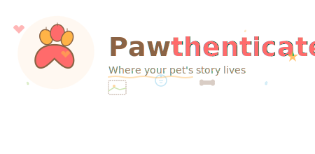

<div align="center">

# 🐾 Pawthenticate



### **Where your pet's story lives**

[](https://pawthenticate.com)
[](LICENSE)
[](https://nextjs.org)
[](https://www.typescriptlang.org)
[](https://tailwindcss.com)

A mobile-first web app that helps Australian renters quickly create professional, landlord-ready pet resumes.


---

**[🚀 Coming Soon](https://pawthenticate.com)** • **[💝 Support Us](#-support-this-project)** • **[📧 Join Waitlist](https://pawthenticate.com)**

</div>

---

## 🎯 The Problem

**65% of Australian renters have pets**, but finding pet-friendly rentals is a nightmare. Landlords want reassurance, but pet owners don't know what information to provide.

**Pawthenticate solves this** by helping pet owners create beautiful, comprehensive resumes that show landlords their pets are responsible, well-behaved tenants.

---

## ✨ What is Pawthenticate?

A **free, mobile-first web app** that guides Australian pet owners through creating professional pet resumes in minutes.

<table>
<tr>
<td width="50%">

### 🎯 **For Pet Owners**
- Create resumes in 5-10 minutes
- Mobile-friendly guided form
- Professional PDF export
- No login required (localStorage)
- 100% free, always

</td>
<td width="50%">

### 🏠 **For Landlords**
- All info in one document
- Vaccination & insurance proof
- Behaviour & training details
- Council registration
- Professional format

</td>
</tr>
</table>

---

## 🚀 Quick Start

### Prerequisites
- Node.js 18+ installed
- A modern web browser

### Installation

```bash
# 1. Install dependencies
npm install

# 2. Run the development server
npm run dev

# 3. Open http://localhost:3000 in your browser
```

That's it! No database setup, no API keys needed for V1. 🎉

---

## 📁 Project Structure

```
Pawthenticate_v1/
├── app/                      # Next.js App Router pages
│   ├── page.tsx             # Home page (landing)
│   ├── create/
│   │   └── page.tsx         # Pet resume form
│   ├── preview/
│   │   └── page.tsx         # Preview & print page
│   ├── dashboard/
│   │   └── page.tsx         # User dashboard
│   ├── auth/
│   │   ├── login/           # Login page
│   │   ├── signup/          # Signup page
│   │   └── forgot-password/ # Password reset
│   ├── layout.tsx           # Root layout wrapper
│   └── globals.css          # Global styles + print styles
│
├── components/              # Reusable UI components
│   ├── PetMasthead.tsx     # Hero section for resumes
│   ├── PetResumeCard.tsx   # Resume display component
│   ├── LoadingSpinner.tsx  # Loading states
│   └── ...
│
├── lib/                     # Utility functions
│   ├── storage.ts          # localStorage helpers
│   ├── pets.ts             # Pet data operations
│   ├── auth.ts             # Authentication (Supabase)
│   ├── emailService.ts     # Email sending (MailerLite)
│   └── pdfGenerator.ts     # PDF export
│
├── types/                   # TypeScript type definitions
│   ├── pet.ts              # Pet data interfaces
│   └── supabase.ts         # Supabase types
│
├── email-templates/         # Email HTML templates
│   ├── confirm-email.html  # Email verification
│   ├── welcome-email.html  # Welcome message
│   └── password-reset.html # Password reset
│
├── coming-soon/            # Landing page files
│   ├── index.html          # Coming soon page
│   ├── README.md           # Setup instructions
│   └── SUBSCRIPTION_SETUP.md  # MailerLite guide
│
├── public/                  # Static assets
│   └── svg/                # Pawthenticate logos and icons
│
├── tailwind.config.ts      # Tailwind CSS configuration
├── tsconfig.json           # TypeScript configuration
├── next.config.js          # Next.js configuration
└── package.json            # Dependencies and scripts
```

---

## 🎨 Features

### ✅ V1 MVP (Current)

<table>
<tr>
<td width="50%">

#### Core Features
- ✅ **Guided Form** - Multi-section form for pet info
- ✅ **Auto-Save** - Form data saves to browser localStorage
- ✅ **Mobile-First** - Optimized for phones, great on desktop
- ✅ **Professional PDF** - Print-to-PDF via browser
- ✅ **No Login Required** - Local-only storage
- ✅ **Australian Focus** - Fields match Aussie landlord needs

</td>
<td width="50%">

#### Pet Resume Sections
1. **Pet Basics** - Name, species, breed, age, size, photo
2. **ID & Legal** - Microchip, council registration
3. **Health** - Desexed, vaccinations, insurance
4. **Behaviour** - Temperament, noise, house training
5. **Documents** - Upload vaccination/desexing certs

</td>
</tr>
</table>

### 🚧 Coming Soon (Future Versions)

- 🔐 **User Accounts** - Save multiple pets to cloud
- 🌐 **Shareable Links** - Share resumes via URL
- 🎨 **Multiple Templates** - Different design options
- 👤 **Owner Profiles** - Add your contact information
- 📊 **Application Tracking** - Track which properties you've applied to
- 🏆 **Pet Verification** - Verified training certificates
- 💬 **Landlord Messaging** - Direct communication feature

---

## 🛠️ Tech Stack

<table>
<tr>
<td>

### Frontend
- **Framework:** Next.js 14 (App Router)
- **Language:** TypeScript
- **Styling:** Tailwind CSS
- **State:** React Hooks
- **Storage:** localStorage (V1)

</td>
<td>

### Backend (Future)
- **Database:** Supabase (PostgreSQL)
- **Auth:** Supabase Auth
- **Storage:** Supabase Storage
- **Email:** MailerLite
- **Hosting:** Vercel/Netlify

</td>
</tr>
</table>

---

## 🎨 Design System

### Color Palette

```
Primary (Coral):     #FF6B6B  ■  Main CTAs and important elements
Secondary (Orange):  #FFB347  ■  Accents and highlights
Accent (Brown):      #8F6548  ■  Subtle emphasis
Neutral (Dark):      #1F2937  ■  Text and dark UI elements
Background (Light):  #F9FAFB  ■  Page backgrounds
```

### Typography

- **Display Text:** Merriweather (serif) - Pet names and headings
- **Body Text:** Lato (sans-serif) - All body content

### Components

Custom Tailwind components for buttons, forms, and cards that follow our brand guidelines.

---

## 📝 How It Works

### User Journey

```
1. 🏠 Landing Page
   User learns about Pawthenticate
   Clicks "Create Pet Resume"
   
2. ✍️ Form Page
   User fills in pet details across 5 sections
   Form auto-saves to localStorage
   
3. 👁️ Preview Page
   User sees their resume as it will print
   Can go back to edit
   
4. 📄 Export
   User clicks "Print / Save as PDF"
   Saves or prints beautiful resume
   
5. 📧 Apply
   User attaches PDF to rental applications
   Increases chances of approval!
```

### Data Storage (V1)

- All data stored in browser's `localStorage`
- Data persists across page refreshes
- No external backend or database
- User can clear data by clearing browser storage
- **Note:** Data is device-specific (not synced)

---

## 🧪 Development

### Error Handling & Debugging

All localStorage operations include comprehensive console logging:

```bash
# Check browser console (F12) for detailed logs:
[Pawthenticate Storage] - Storage operations
[Form] - Form state changes and auto-save
[Preview] - Preview page data loading
```

### Common Issues & Solutions

<details>
<summary><strong>Form data disappears after refresh</strong></summary>

**Cause:** localStorage not available (private browsing mode)  
**Solution:** Use regular browsing mode, check console for errors
</details>

<details>
<summary><strong>File upload fails</strong></summary>

**Cause:** File too large (>5MB)  
**Solution:** Use smaller images, compress photos before uploading
</details>

<details>
<summary><strong>Print layout looks wrong</strong></summary>

**Cause:** Browser not applying print styles  
**Solution:** Use "Save as PDF" instead of "Print" in the print dialog
</details>

---

## 💝 Support This Project

<div align="center">

### Help us bring Pawthenticate to life! 🚀

**Love what we're building?** Your support helps us:
- 💻 Develop new features
- 🖥️ Maintain servers
- 🎨 Improve design
- 🌏 Keep Pawthenticate FREE for all Aussie pet owners

<a href="https://www.paypal.com/donate/?hosted_button_id=YOUR_PAYPAL_BUTTON_ID">
  
</a>

**Or send directly to:** `hello@pawthenticate.com` via PayPal

---

### 🐾 Donation Tiers

| Amount | Impact |
|--------|--------|
| ☕ **$5** | Covers hosting for 1 month |
| 🎨 **$10** | Funds design improvements |
| 🚀 **$25** | Enables new features (shareable links, templates) |
| 💎 **$50** | Covers email service for 3 months |
| 🌟 **$100+** | Accelerates full launch + cloud storage |

*All contributions are deeply appreciated but never required.*  
*Pawthenticate will always be free for pet owners!* ❤️

---

**Thank you to our supporters!** 🙏  
*Every dollar brings us closer to launch.*

</div>

---

## 📱 Browser Support

Works best on:
- ✅ Chrome 90+
- ✅ Safari 14+
- ✅ Firefox 88+
- ✅ Edge 90+
- ✅ Mobile browsers (iOS Safari, Chrome Android)

---

## 🤝 Contributing

This is currently a solo learning project for V1 MVP. However, you're welcome to:

- 🐛 **Report bugs** via GitHub issues
- 💡 **Suggest features** for future versions
- 🍴 **Fork and experiment** with your own version
- 💝 **Support financially** via PayPal

Future versions may accept code contributions!

---

## 💡 Tips for Developers

### Adding New Form Fields

```typescript
// 1. Add field to types/pet.ts interface
export interface PetData {
  // ... existing fields
  newField: string;
}

// 2. Add input in app/create/page.tsx
<input
  type="text"
  value={formData.newField}
  onChange={(e) => handleChange('newField', e.target.value)}
/>

// 3. Display in app/preview/page.tsx
<p>{petData.newField}</p>

// 4. Auto-save handles storage automatically!
```

### Customizing Colors

Edit `tailwind.config.ts` - all color values are centralized:

```typescript
colors: {
  primary: '#FF6B6B',
  secondary: '#FFB347',
  accent: '#8F6548',
  // ...
}
```

### Debugging Storage Issues

```typescript
// Open browser console
localStorage.getItem('pawthenticate-pet-data')  // View stored data
localStorage.clear()  // Clear all data
```

### Testing Print Layout

Use Chrome's print preview (`Ctrl/Cmd + P`) to see PDF output without printing.

---

## 📧 Email & Marketing

### MailerLite Integration

We use **MailerLite** for:
- 📬 Waitlist email subscriptions
- 📧 Launch announcements
- 📰 Newsletters & updates
- 🎉 Welcome email sequences

**Setup guides:**
- [`coming-soon/SUBSCRIPTION_SETUP.md`](coming-soon/SUBSCRIPTION_SETUP.md) - Complete MailerLite setup
- [`email-templates/README.md`](email-templates/README.md) - Email template usage

**Why MailerLite?**
- ✅ Free up to 1,000 subscribers
- ✅ 12,000 emails/month
- ✅ Drag & drop email builder
- ✅ Automated workflows
- ✅ Forms & landing pages included

---

## 🚀 Deployment

### Coming Soon Page

```bash
# Deploy the landing page first
cd coming-soon
# Follow instructions in coming-soon/README.md
```

### Main Application

```bash
# Build for production
npm run build

# Deploy to Vercel (recommended)
vercel

# Or deploy to Netlify
netlify deploy --prod
```

---

## 📄 License

**ISC License** - Free to use and modify

---

## 🐾 Roadmap

### Phase 1: MVP Launch (Current)
- [x] Core form functionality
- [x] PDF export
- [x] Mobile-responsive design
- [x] localStorage persistence
- [ ] Coming soon page live
- [ ] 100 beta testers

### Phase 2: User Accounts (Q1 2025)
- [ ] Supabase authentication
- [ ] Cloud storage
- [ ] Multiple pets per user
- [ ] Email notifications

### Phase 3: Sharing & Templates (Q2 2025)
- [ ] Shareable links
- [ ] Multiple resume templates
- [ ] Custom branding options
- [ ] Owner profile sections

### Phase 4: Premium Features (Q3 2025)
- [ ] Application tracking
- [ ] Landlord verification
- [ ] Pet training certificates
- [ ] Analytics dashboard

---

## 🆘 Need Help?

<div align="center">

**Questions? Stuck? Feedback?**

📧 **Email:** [hello@pawthenticate.com](mailto:hello@pawthenticate.com)

📚 **Documentation:**
- [Coming Soon Setup](coming-soon/README.md)
- [Email Setup](coming-soon/SUBSCRIPTION_SETUP.md)
- [Email Templates](email-templates/README.md)

🐛 **Found a bug?** [Open an issue](https://github.com/yourusername/pawthenticate/issues)

💝 **Want to support?** [Donate via PayPal](#-support-this-project)

</div>

---

<div align="center">

## 🌟 Made with ❤️ for Australian Pet Owners & Renters

**Pawthenticate** is on a mission to make pet-friendly renting easier for everyone.

*Every pet deserves a home. Every owner deserves a chance.* 🐾

---

[](https://nextjs.org)
[](https://www.typescriptlang.org)
[](https://tailwindcss.com)
[](https://www.mailerlite.com)
[](https://www.paypal.com)

**[🚀 Join Waitlist](https://pawthenticate.com)** • **[💝 Donate](https://www.paypal.com/donate/?hosted_button_id=YOUR_BUTTON_ID)** • **[📧 Contact Us](mailto:hello@pawthenticate.com)**

</div>
